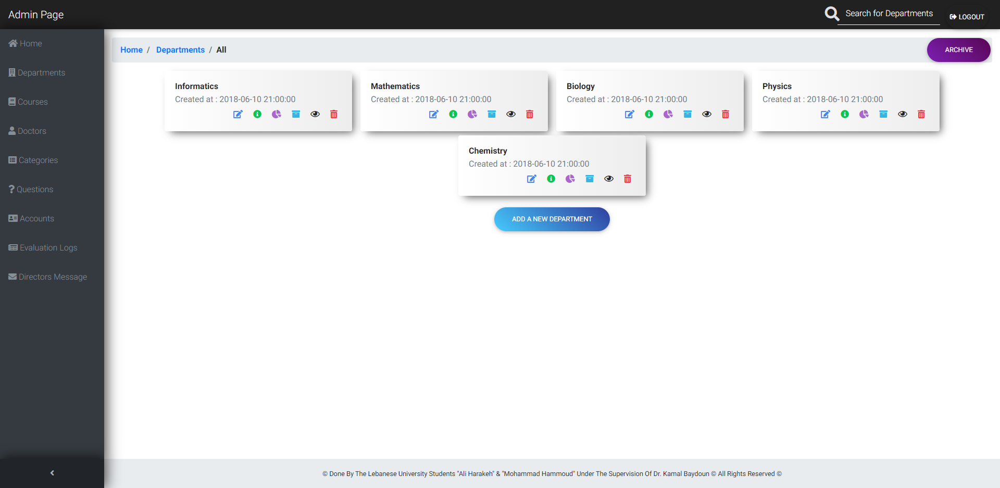
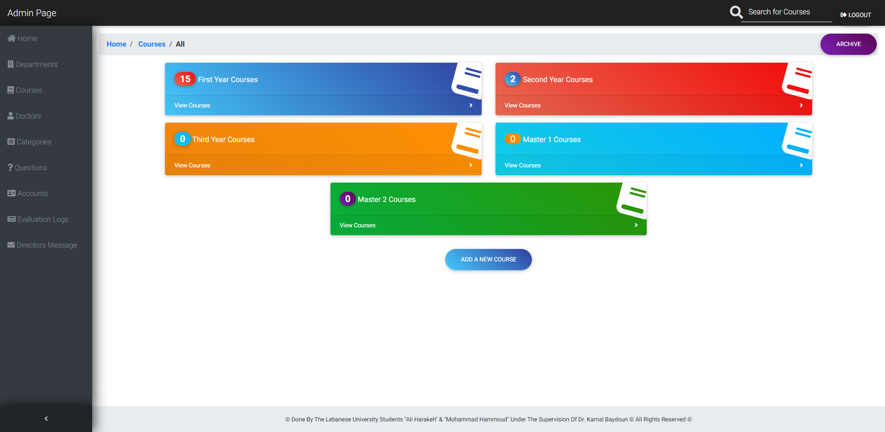
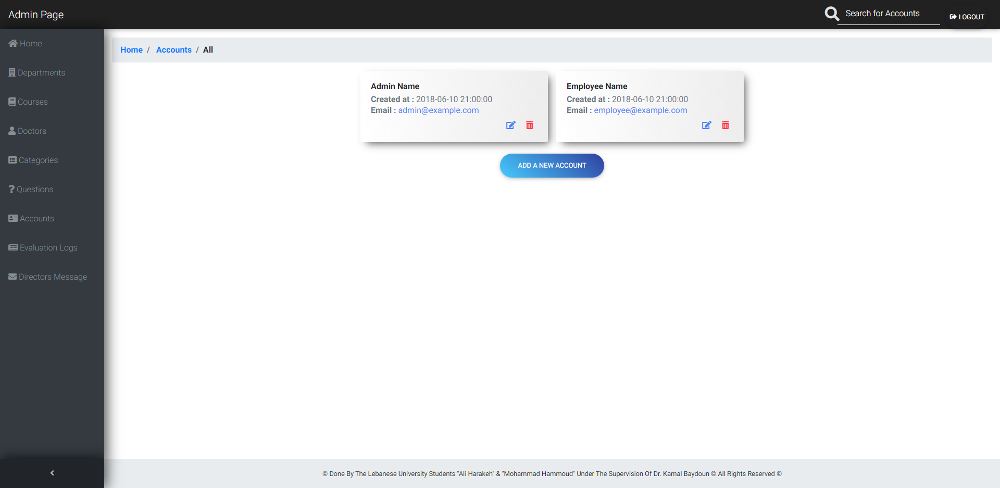

- [Doctors Evaluations](#doctors-evaluations)
      - [Sections:](#sections)
      - [Tools Used](#tools-used)
- [Dashbard](#dashbard)
  - [Home Page](#home-page)
  - [Content Pages](#content-pages)
  - [Add / Edit / Delete](#add--edit--delete)
  - [Evaluations](#evaluations)
  - [Archives](#archives)
- [Employee Form](#employee-form)
- [Evalution Questionare](#evalution-questionare)

# Doctors Evaluations
The goal of this project was to provide the University with statistical data about how students evaluated their doctors and whether the doctors were doing their job correctly or not. This evaluation was done by students who answered some questions about their doctors' ways of handling them and providing teaching/learning materials.

#### Sections:
- **Employee Form:** The employee enters the site URL and logs in as an employee with his account to open a `form` where he can configure the evaluation settings (like what class and doctor to evaluate) and then start the evaluation process where an `evaluation URL` is generated so that students can use it to open the questionare site and start their evaluation.

- **Admin Dashboard:** The admin logs in as an admin to open the administration dashboard where he can access and edit all data about available University Faculty `Departments, Courses, Doctors, Evaluations, Users, Archives, Logs, and Evaluations`. He then can access the statistics of the evaluations and `generate a pdf` of each evaluation to show it to the appropriate University personnel. An evaluation report can be generated for a Department, a Course, or a Doctor.

#### Tools Used
  - **Backend:** Laravel PHP Framework
  - **Frontend:** HTML & Laravel's Blade Templates
  - **Styling:** Bootstrap CSS Framework

# Dashbard
Here are some screenshots of some of the dashboard features

## Home Page
The home page shows how many items are there for each section in the dashboard and shows the latest evaluations done on the right side of the page.

## Content Pages
The Dashboard is separated into the follwing content sections.

- Departments
  
- Courses
  
- First Year Courses
  
- Doctors
  
- Users
  
- Questions
  
- Categories
  

## Add / Edit / Delete
Some of the features of some section.

- Add Course
  
- Edit Course
  
- Edit Course's Dcotrors
  
- Add Doctor
  
- Edit Doctor
  
- Edit Doctor's Courses
  
- Edit/Delete Department's Courses & Doctors
  
- Add Evaluation Question
  

## Evaluations
Evaluation reports are generated for each Department, Course, & Dcotor. The report is generated with respect to the chosen university year (ex: 2017-2018, 2018-2019, ...). These reports can also be exported and downloaded as pdf.

- Evaluated Departments (also avaiable for Doctors & Courses)
  
- Department
  
- Doctor (also available for Courses)
  
- Evaluation Logs
  
- Doctors Evaluation Comments
  

## Archives
All deleted data is archived.

- Course's Doctors Archives (also available for Departments & Doctors)
  
  

# Employee Form
The Employee section.

- Evaluation Form
  
- Generated Evaluation Link & Progress
  
- Evalaution Done
  

# Evalution Questionare
The Students section.

