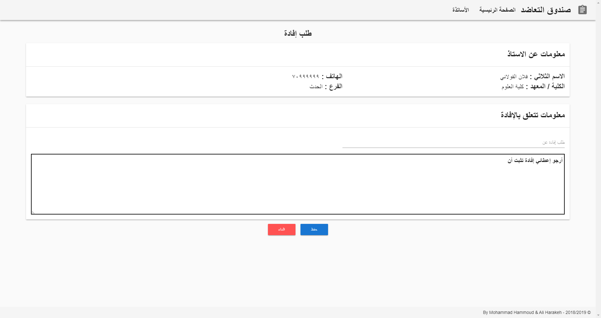

# Table of Content
- [University Papers](#university-papers)
- [Tools](#tools)
- [Screenshots](#screenshots)
  - [Doctors](#doctors)
  - [Generate Papers](#generate-papers)
  - [Other Papers Samples](#other-papers-samples)

# University Papers
The goal of this project was to provide the University with an app that helps their insurance employees to better fill the required papers correctly and faster by automatically filling the needed data and facilitate the operation of entering the other required data for them.

# Tools
- **App Scafolding:** Electron for cross-platform apps using web technologies.
- **Web Technologies**: Node.js & Vue.js for app content & logic.
- **Database:** Sqlite for a local database.
- **Styling:** Vuetify library for Vue material components.

# Screenshots

## Doctors
- Add
  
- Edit / Delete / View Papers Archive
  
- Archive
  

## Generate Papers
1. Choose Doctor
   
2. Choose Paper
   
3. Fill Paper
   
4. Fill Paper Data
   
5. Check Filled Paper
   
6. Generate PDF
   

## Other Papers Samples

